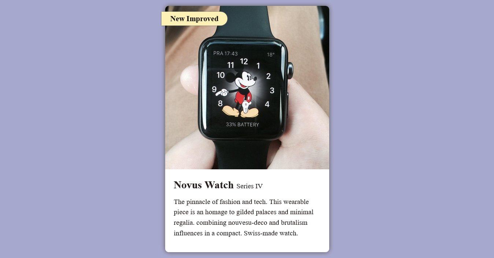

# Altschool CSS Hands-On Assignment 3

## Table of contents

- [Overview](#overview)
  - [Screenshot](#screenshot)
  - [Links](#links)
- [My process](#my-process)
  - [Built with](#built-with)
  - [What I learned](#what-i-learned)
- [Author](#author)

## Overview

This is the finished solution

### Screenshot

### Links

- Live Site URL: [url]()

## My process

### Built with

- Semantic HTML5 markup
- CSS
- Mobile-first workflow

## Author

- Linkedin - [@Nweze Daniel](https://www.linkedin.com/in/daniel-nweze-017909214/)
